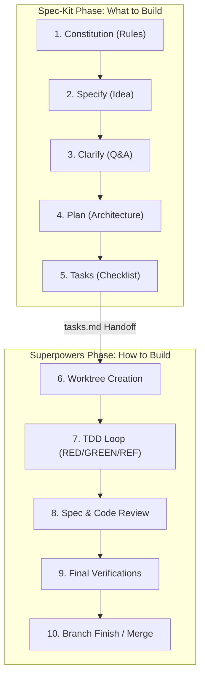

# AI Engineering Cookbook

Practical patterns, structures, and guidelines for building software autonomously with AI agents.

This cookbook provides an opinionated engineering workflow that combines **[Spec-Kit](https://github.com/github/spec-kit)** for planning ("what to build") and **[Superpowers](https://github.com/obra/superpowers)** for execution ("how to build it"), augmented with curated community extensions and an AI governance layer.

---

## 🤔 New Here? What Is AI-Native Engineering?

AI-Native Engineering is a development approach where **AI agents write the majority of the code** — but humans stay firmly in control by defining clear intent upfront and verifying outcomes rigorously.

Think of it this way: instead of writing code yourself, you write a precise *specification* of what the code should do. An AI agent then implements it, test by test, under strict constraints you set. Your role shifts from **code author** to **intent definer and outcomes verifier**.

This cookbook gives you the workflow, tools, and guardrails to do that safely and repeatably.

> **New to this?** Follow the [Learning Path](#learning-path-start-here) below before diving into the guides. Don't know a term? Check the [Glossary](./GLOSSARY.md).

---

## 🌐 Browse it on the web

Prefer reading in a browser? The cookbook has a landing page that indexes every guide, shows the workflow as a diagram, and works on a phone:

👉 **[exponen-agi.github.io/ai-engineering-cookbook](https://exponen-agi.github.io/ai-engineering-cookbook/)**

---

## 🎨 Interactive Cookbook Explorer

The AI Engineering Cookbook is accompanied by a modern, interactive web application that provides a comprehensive visual walkthrough of the entire agentic SDLC workflow, agent profiles, verification gates, and community extensions.

👉 **[Explore the Interactive Cookbook Explorer](https://exponen-agi.github.io/ai-engineering-cookbook/design/cookbook-explorer.html)** (hosted on GitHub Pages, or view the [local code and guides](./design/README.md))

[](https://exponen-agi.github.io/ai-engineering-cookbook/design/cookbook-explorer.html)

---

## 🗺️ Visual SDLC Workflow

The diagram below shows how the workflow is split: Spec-Kit manages specification and planning, while Superpowers drives isolated test-driven implementation.



---

## 🧰 Installable Skills

This repo ships portable **[Agent Skills](https://agentskills.io/specification)** (`SKILL.md`) you can drop into any compatible agentic tool — Claude Code, Cursor, Roo Code, VS Code Copilot, OpenAI Codex, Google Antigravity. The same skill file works everywhere; only the install folder differs.

**Install any skill directly inside your target repository using `npx`:**

```bash
# Install Doc Coherence
npx ai-engineering-cookbook doc-coherence

# Install Prompt Optimizer
npx ai-engineering-cookbook prompt-optimizer

# Install Skill Review
npx ai-engineering-cookbook skill-review
```

*(You can also run `npx ai-engineering-cookbook` without arguments for an interactive menu that lets you pick a skill **and** select one or more coding-agent environments to install into.)*

### 🎛️ Choosing your coding-agent environment

Skills are not Claude-only. Run the bare command and the installer asks which agent environment(s) you want — you can **multi-select** by entering comma-separated numbers (e.g. `1,3,5`):

| Environment | Skill folder |
| :--- | :--- |
| Claude Code | `.claude/skills` |
| Cursor | `.cursor/skills` |
| GitHub Copilot (VS Code) | `.github/skills` |
| OpenAI Codex | `.codex/skills` |
| Google Antigravity | `.agents/skills` |
| Roo Code | `.roo/skills` |
| **Others** | `.coding/skills` → rename `.coding/` to your tool's folder after install |

Pick **Others** for any agent not in the list: the skill lands in a generic `.coding/` folder and the installer tells you to rename it to whatever directory your tool reads. You can also target a specific tool non-interactively with `--tool`:

```bash
npx ai-engineering-cookbook doc-coherence --tool cursor
npx ai-engineering-cookbook prompt-optimizer --tool codex
npx ai-engineering-cookbook prompt-optimizer --tool others   # → .coding/, rename afterward
```

| Skill | What it does | Run inside your repo |
| :--- | :--- | :--- |
| **🎯 [Prompt Optimizer](./docs/prompt-optimizer.md)** | Turns vague requests into production-grade prompts — framework selection, model calibration, red-team, scorecard. Optional Claude Code session-start gate. | `npx ai-engineering-cookbook prompt-optimizer` |
| **🔗 [Doc Coherence](./docs/doc-coherence.md)** | Single-source-of-truth registry + deterministic CI gate that fails the build when one doc restates a fact owned by another. | `npx ai-engineering-cookbook doc-coherence` |
| **🔍 [Skill Review](./docs/skill-review.md)** | Vets a `SKILL.md` before you install, publish or trust it — spec conformance, portable vs vendor-only fields, and characters a reviewer cannot see. Ships a deterministic CI gate. | `npx ai-engineering-cookbook skill-review` |

### 🛠️ Troubleshooting & Installation Fallbacks

If the direct `npx` command fails or you are working in an environment with restricted network access/unresolved binary shims (common with direct GitHub URLs on Windows), choose one of these fallbacks:

#### Option A: Local DevDependency (Recommended)

Install the package locally to your target project. This ensures npm correctly configures binary shims on all operating systems:

```bash
# From npm registry:
npm install --save-dev ai-engineering-cookbook

# OR from GitHub directly:
npm install --save-dev github:exponen-agi/ai-engineering-cookbook

# Run the skill installer:
npx ai-engineering-cookbook doc-coherence
```

#### Option B: Global Installation

Install the CLI tool globally on your system:

```bash
# From npm registry:
npm install -g ai-engineering-cookbook

# OR from GitHub directly:
npm install -g github:exponen-agi/ai-engineering-cookbook

# Run the installer commands:
ai-engineering-cookbook doc-coherence
ai-engineering-cookbook prompt-optimizer
```

*(Alternatively, you can run the direct script shortcuts: `install-doc-coherence` or `install-prompt-optimizer`.)*

---

## 📚 Cookbook Documentation Directory

| Guide | Description | Key Focus |
| :--- | :--- | :--- |
| **🎨 [Cookbook Explorer](https://exponen-agi.github.io/ai-engineering-cookbook/design/cookbook-explorer.html) ([Local](./design/README.md))** | Interactive visual companion to explore the cookbook. | Interactive SDLC, agents, verification gates, and extensions |
| **🚀 [Quickstart Guide](./QUICKSTART.md)** | Start here! Launch your first AI-native feature in 5 minutes. | CLI cheatsheet, 3-step setup |
| **📦 [Installation & Setup](./docs/installation.md)** | Prerequisites and global configuration steps. | uv, specify-cli, plugins |
| **🌱 [Greenfield Workflows](./docs/greenfield.md)** | Building new features and applications from scratch. | Next.js Expense Tracker example |
| **🍂 [Brownfield Workflows](./docs/brownfield.md)** | Safe development in legacy or existing codebases. | Express.js JWT Auth example |
| **🛡️ [AI Governance & Observability](./docs/governance.md)** | The SDLC flywheel, logs, postmortems, and agent roles. | reflections, blameless logs |
| **🧩 [Community Extensions](./docs/extensions.md)** | 20 curated plugins to enhance security, scope, and testing. | Extension maps, decision guide |
| **🎯 [Prompt Optimizer Skill](./docs/prompt-optimizer.md)** | Production prompt engineering skill + optional session-start gate. Install via [Installable Skills](#-installable-skills). | Framework selection, model calibration, scorecard |
| **🧭 [Context Engineering](./docs/context-engineering.md)** | The 6 Context-Engine principles mapped honestly to this repo's mechanisms. | Conflict resolution, token optimization, scope boundaries |
| **🔌 [Agent Standards](./docs/agent-standards.md)** | The three open standards every 2026 agent reads: AGENTS.md, Agent Skills, and MCP. | Progressive disclosure, stateless MCP, per-platform config paths |
| **📊 [Evaluation & Observability](./docs/evaluation-and-observability.md)** | Telling whether the model's output was actually good — traces vs. evals. | Golden datasets, judge calibration, OpenTelemetry GenAI |
| **🛡️ [Agent Security](./docs/agent-security.md)** | Stopping an agent from being turned against you by the text it reads. | Prompt injection, the lethal trifecta, reviewing a skill before you install it, scanning a skill for invisible instructions |
| **🔗 [Doc Coherence Skill](./docs/doc-coherence.md)** | Single-source-of-truth registry + CI gate that flags cross-doc drift. Install via [Installable Skills](#-installable-skills). | Canonical owners, authority order, deterministic gate |
| **🔍 [Skill Review Skill](./docs/skill-review.md)** | Checking a `SKILL.md` before you trust it, and writing one that works in every tool. Install via [Installable Skills](#-installable-skills). | The six portable fields, hidden characters, the `check-skills` gate |
| **🔧 [Troubleshooting](./docs/troubleshooting.md)** | Common failure scenarios and step-by-step fixes. | Install errors, TDD issues, phantom completions |
| **🧱 [Toolchain & Node Baseline](./docs/toolchain.md)** | Which Node.js version this repo needs, and why every CI tool is pinned. | Node baseline, pinned CI tools, the `check:toolchain` gate |
| **🔒 [Security Policy](./SECURITY.md)** | What counts as a vulnerability here and how to report one privately. | Private reporting, scope, dry-running an installer |
| **📖 [Glossary](./GLOSSARY.md)** | Plain-English definitions for every key term. | 30+ terms from AI Agent to Worktree |
| **🤝 [Contributing](./CONTRIBUTING.md)** | How to improve the cookbook and add new content. | PR checklist, style guide, extension submissions |

---

## Learning Path (Start Here)

Not sure where to begin? Follow this sequence:

| Step | You Are... | Go To |
| :---: | :--- | :--- |
| 1 | **Brand new** — never used AI agents for coding | [Quickstart Guide](./QUICKSTART.md) |
| 2 | **Setting up** your local machine | [Installation & Setup](./docs/installation.md) |
| 3 | **Starting a new project** from scratch | [Greenfield Workflow](./docs/greenfield.md) |
| 4 | **Adding AI to an existing project** | [Brownfield Workflow](./docs/brownfield.md) |
| 5 | **Curious about governance** and quality gates | [AI Governance & Observability](./docs/governance.md) |
| 6 | **Want more tools** and plugins | [Community Extensions](./docs/extensions.md) |
| 7 | **Want a sharper prompt** before starting work | [Prompt Optimizer Skill](./docs/prompt-optimizer.md) |
| 8 | **Wondering how agents connect** to tools and data | [Agent Standards](./docs/agent-standards.md) |
| 9 | **Building a feature that calls a model** and need to score it | [Evaluation & Observability](./docs/evaluation-and-observability.md) |
| 10 | **About to connect a tool or install a skill** you did not write | [Agent Security](./docs/agent-security.md) |
| 11 | **Holding a skill file** and wondering whether it is safe and portable | [Skill Review](./docs/skill-review.md) |
| 12 | **Stuck on something** | [Troubleshooting Guide](./docs/troubleshooting.md) |
| 13 | **Want to contribute** | [Contributing Guide](./CONTRIBUTING.md) |

---

## 💡 The Five Principles of AI-Native Engineering

In well-structured agentic pipelines, AI agents generate approximately **75% of the implementation code**. This changes the human role from *code author* to *intent definer, outcomes verifier, and system governor*.

We enforce five core principles to manage this shift safely:

1. **Intent First, Code Second**: Code that passes tests but misses design intent is a liability. Clarify intent before generating.
2. **Verify, Don't Just Generate**: Value is measured by spec adherence, not lines produced. A smaller, correct implementation is always preferred.
3. **Precision Over Productivity**: Architectural consistency protects the codebase. Adhere to project guidelines even if they require extra steps.
4. **Observability is Non-Negotiable**: Every coding session must record reflections to feed the continuous learning loop.
5. **Blameless Culture**: Production bugs and gate escapes are system failures. We update spec-rules, check-gates, or prompt-skills to prevent them, rather than blaming the developer or agent.

---

## 📖 Glossary — canonical terms

To prevent the same concept being called different things across docs, these are the canonical names. Use them exactly; everything else points here.

| Term | Means | Not to be confused with |
| :--- | :--- | :--- |
| **Spec-Kit** | The product/methodology for spec-driven development. | — |
| **specify-cli** | The CLI package that installs Spec-Kit (`uv tool install specify-cli`). | the `/speckit.*` commands |
| **`.specify/`** | The directory Spec-Kit creates for specs, plans, tasks, and constitution. | specify-cli (the tool) |
| **`/speckit.*`** | The slash commands (`/speckit.specify`, `/speckit.plan`, …). | specify-cli (the tool) |
| **Superpowers** | The Claude Code plugin (`/plugin install superpowers@…`) providing TDD/worktree skills. | this repo's local `skills/` |
| **The Five Principles** | The *philosophy* (why) — authored in this README. | the Five Directives |
| **The Five Directives** | The *operational rules* (how) — authored in [CLAUDE.md](./CLAUDE.md) §5. | the Five Principles |
| **`skills/`** | Canonical source for this repo's installable skills. | `.claude/skills/` (generated install output — never hand-edited) |

---

### 🤝 Contributing

We welcome contributions! Read our [Contributing Guide](./CONTRIBUTING.md) before submitting a PR — it covers branch naming, style guide, how to add new extensions, and the PR checklist.

---

### 📄 License

This project is released under the [MIT License](./LICENSE). You are free to use, copy, modify, and redistribute it — including commercially — as long as the copyright notice and license text travel with it.
