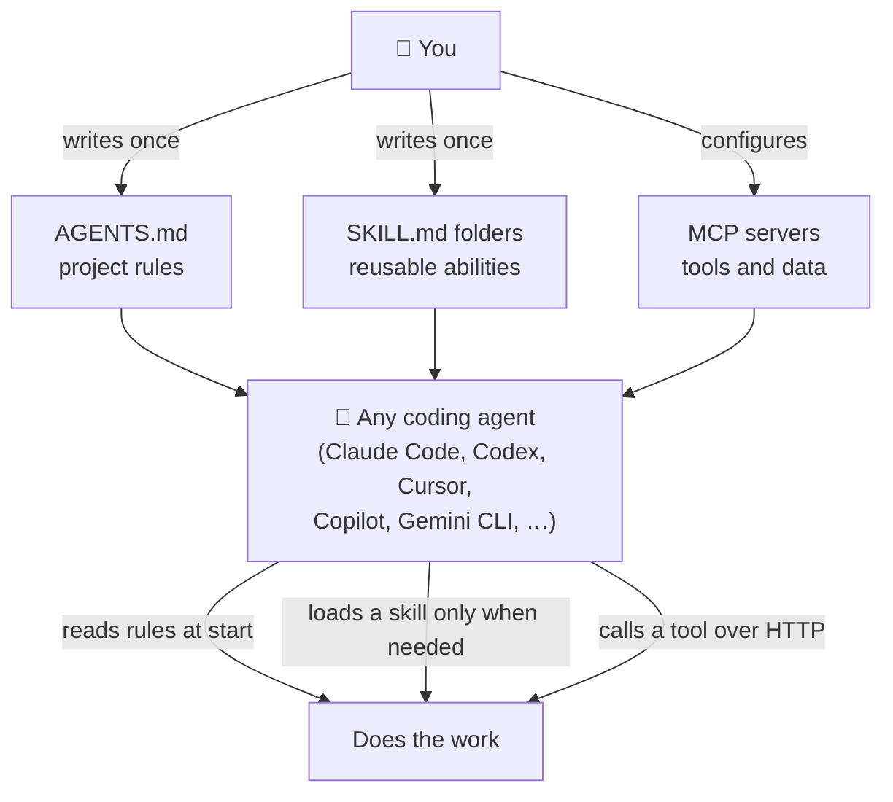
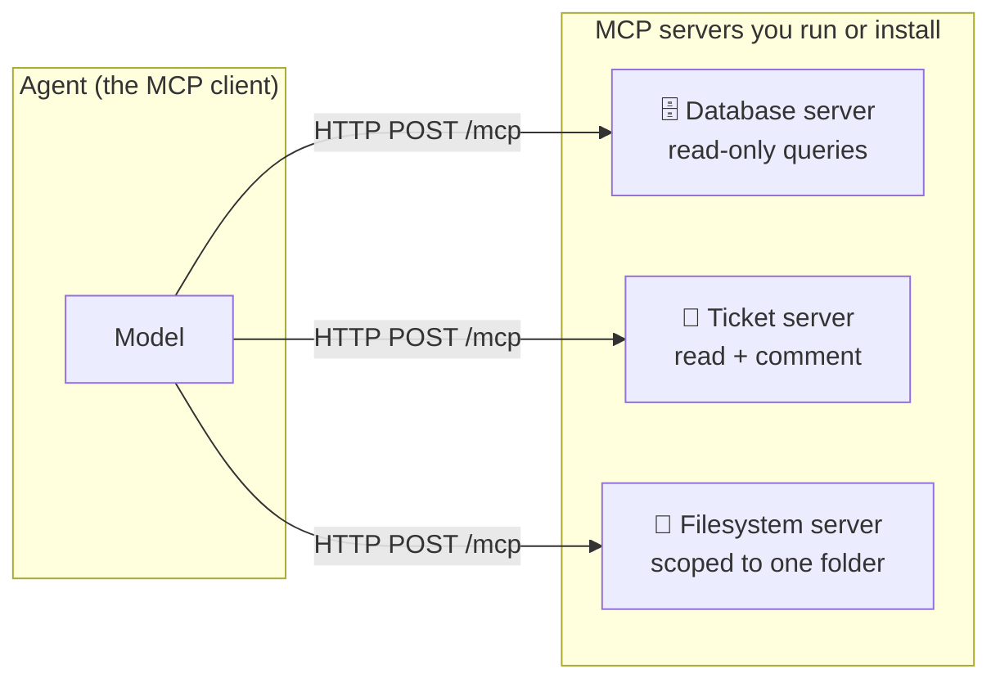

# Agent Standards — AGENTS.md, Skills, and MCP

Three open standards decide how your AI agent gets its instructions, its abilities, and its tools. If you learn only three things about the 2026 ecosystem, learn these three.

This guide assumes **no prior AI experience**. Every term is explained the first time it appears.

> **Why this matters:** In 2025 every coding agent had its own config file, its own plugin format, and its own way of connecting to your database. In 2026 they converged. You now write the instructions once and every agent reads them.

---

## 🧱 The three layers, in one picture



Each layer answers a different question:

| Layer | Answers | When the agent loads it | Lives at |
| :--- | :--- | :--- | :--- |
| **AGENTS.md** | *"How does this project work?"* | Always — at the start of every session | Your repo root |
| **SKILL.md** | *"How do I do this specific thing?"* | Only when a task needs it | A folder in your repo or agent config |
| **MCP** | *"What can I actually reach?"* | Every time it calls a tool | A separate server process or URL |

Getting these confused is the most common mistake people make in 2026. The rule of thumb:

- **Project knowledge → AGENTS.md.** It is always in the agent's memory, so keep it short.
- **Reusable know-how → a skill.** It costs almost nothing until it is used.
- **Live systems → MCP.** Anything that needs to read or write real data.

---

## 1️⃣ AGENTS.md — the rules of your project

`AGENTS.md` is a plain Markdown file at the root of your repository. It tells any coding agent how to work in this codebase: how to install, how to run the tests, which folders are off limits, which style to follow.

It is deliberately boring. There is no schema and no required fields — it is just Markdown that the agent reads before it starts.

**A minimal example:**

```markdown
# AGENTS.md

## Setup
npm install

## Tests
npm test          # must pass before any commit

## Rules
- Never edit files in `dist/` — they are generated.
- Use tabs, not spaces.
```

**Why it caught on:** the same file is read by Claude Code, OpenAI Codex, Cursor, GitHub Copilot, Gemini CLI, and many others. You stop maintaining one config file per tool.

> [!NOTE]
> This repository already has an [`AGENTS.md`](../AGENTS.md). It points every agent at [`CLAUDE.md`](../CLAUDE.md) as the single entry point, so there is exactly one place where the rules live.

**Keep it short.** Because `AGENTS.md` is loaded on *every* session, every line you add costs tokens on every run. If a piece of guidance is only needed occasionally, it belongs in a skill instead.

---

## 2️⃣ Agent Skills — reusable abilities, loaded on demand

A **skill** is a folder containing a `SKILL.md` file. That file has a small YAML header (`name` and `description` are the only required fields) and a Markdown body of instructions. It may also ship helper scripts and reference files.

```text
my-skill/
├── SKILL.md          ← the instructions (required)
├── scripts/          ← optional helper scripts the agent may run
└── references/       ← optional extra documents it may read
```

```markdown
---
name: release-notes
description: Write release notes from a git log. Use when the user asks for
  a changelog, release notes, or a summary of what shipped.
---

# Release notes

1. Run `git log --oneline <last-tag>..HEAD`.
2. Group commits by type (feat / fix / chore).
3. Write one plain-English line per user-visible change.
```

### Progressive disclosure — the idea that makes skills cheap

This is the important part, and it is simpler than it sounds. A skill loads in **three stages**:

```text
STAGE 1  name + description  (~100 tokens)
         ├─ always in the agent's context, for every installed skill
         └─ this is how the agent decides whether the skill is relevant

STAGE 2  the SKILL.md body
         ├─ loaded ONLY when the description matches the current task
         └─ keep it under a few thousand tokens

STAGE 3  scripts/ and references/
         └─ read only if the SKILL.md body actually points to them
```

So you can install fifty skills and pay for only the fifty descriptions until one is actually needed. That is what makes a large skill library practical.

> [!IMPORTANT]
> The `description` field is doing the real work. It is the only thing the agent sees when deciding whether to use your skill. Write it as *"Do X. Use when the user asks for Y or Z."* — name the trigger words a user would actually type.

**This repository ships four skills** you can install into your own project — see [Installable Skills](../README.md#-installable-skills). The same `SKILL.md` file works in Claude Code, Cursor, Codex, Copilot, Roo Code and Antigravity; only the install folder differs.

### How skills get distributed

Writing a skill is half the problem; getting it onto a machine is the other half. By 2026 four routes are in common use, and they differ mainly in **who owns the files afterwards**.

```text
                        ┌─────────────────────────────┐
  you copy the file  ──►│  YOU OWN IT                 │
  (git, npx installer)  │  editable, pinned, reviewed │
                        │  you update it yourself     │
                        └─────────────────────────────┘

                        ┌─────────────────────────────┐
  you subscribe      ──►│  THE PUBLISHER OWNS IT      │
  (plugin marketplace)  │  read-only, auto-updating   │
                        │  it can change under you    │
                        └─────────────────────────────┘
```

| Route | What it looks like | Owns the files |
| :--- | :--- | :--- |
| **Copy into your repo** | A `SKILL.md` committed alongside your code, often placed by an installer such as this repo's `npx ai-engineering-cookbook …` | You |
| **Plugin marketplace** | A manifest listing several plugins; a user adds the marketplace, then installs from it. This repo publishes one — see [Installable Skills](../README.md#-installable-skills) | The publisher |
| **A skills CLI** | A general-purpose installer that pulls a skill from any git host into whichever agent folder you use | You |
| **Served over MCP** | An MCP server exposes skills as resources instead of files on disk, so a whole team gets the same version without anyone installing anything | The server operator |

The fourth route is the newest: an official MCP **Skills extension** was finalised in September 2026 against the `2026-07-28` base protocol revision, letting a server publish skills rather than every developer downloading them. It is worth knowing the direction of travel, but check the current specification before building on it — this area is moving quickly.

> [!CAUTION]
> **Listing is not vetting.** No major skill registry reviews what it hosts; most check only that you control the domain or repository you claim. Trojanised MCP servers and skills carrying injected instructions have both been found in the wild. Pin a version rather than fetching fresh on every run, and read the file before you trust it — [Skill Review](./skill-review.md) is the checklist, and [Agent Security](./agent-security.md) explains the attacks.

### AGENTS.md or a skill? — a decision table

| You want to say... | Put it in |
| :--- | :--- |
| "Run `npm test` before committing" | `AGENTS.md` — needed every session |
| "This repo uses PostgreSQL, not MySQL" | `AGENTS.md` — always relevant context |
| "Here is our 40-step process for writing a migration" | A skill — long, and only sometimes needed |
| "Here is how to review a prompt for quality" | A skill — reusable across projects |
| "Never touch `design/cookbook-explorer.html`" | `AGENTS.md` — a rule that must never be missed |

---

## 3️⃣ MCP — connecting the agent to real tools and data

**MCP (Model Context Protocol)** is a standard way for an agent to call tools and read data that live outside itself: a database, a ticket tracker, an internal API, your file system.

Before MCP, every agent needed a custom integration for every system. With MCP you write one **server** that exposes your system, and every MCP-capable **client** can use it.



### ⚠️ MCP became stateless — what changed on 2026-07-28

This is the change most likely to make older tutorials wrong, so it is worth understanding.

**Before** (spec revisions up to `2025-11-25`): a client had to open a session first. It sent an `initialize` request, got back a session ID, and put that ID in a header on every following request. The server had to remember that session. That meant sticky load balancing, shared session storage, and a server that could not simply be restarted.

**Now** (spec revision `2026-07-28`): there is no handshake and no session ID. Every request carries everything the server needs — the protocol version, who the client is, and what it can do. A server asks *"what do you support?"* through a `server/discover` call instead.

```text
BEFORE (stateful)                      NOW (stateless)
─────────────────────────              ─────────────────────────
1. initialize  ──────────►             1. server/discover ──────►  (optional, cacheable)
2. ◄────── session id                  2. tools/call      ──────►
3. tools/call + session id ──►            every request is complete
   (must hit the SAME instance)           and can hit ANY instance
```

**Why you should care, in practical terms:**

- An MCP server is now an ordinary HTTP service. Put it behind a normal round-robin load balancer, run it on serverless, scale it to zero.
- No session storage means one whole category of bug disappears.
- Discovery results are cacheable (the response carries a `ttlMs`), so clients stop re-asking.
- Method and tool names now travel in HTTP headers (`Mcp-Method`, `Mcp-Name`), so a gateway can route and authorize a request without parsing the body.

> [!WARNING]
> **Any MCP guide written before August 2026 is likely to be wrong.** If a tutorial tells you to call `initialize` or to store an `Mcp-Session-Id`, it is describing the old protocol. Check the revision date at the top of the page before you follow it.

### Who owns these standards now

In December 2025, MCP, `AGENTS.md`, and Block's `goose` agent runtime were donated to the **Agentic AI Foundation (AAIF)**, a new body under the Linux Foundation. It launched with backing from AWS, Anthropic, Block, Bloomberg, Cloudflare, Google, Microsoft and OpenAI, among others.

For you as an engineer this matters in one concrete way: these are no longer one company's formats that could be withdrawn or changed unilaterally. Building on them is a safer bet than it was a year ago.

---

## 4️⃣ A2A — the fourth standard, and why you probably do not need it yet

You will see **A2A (Agent2Agent)** listed next to the three above, so it is worth knowing where it fits — and where it does not.

MCP connects an agent **down** to tools and data. A2A connects an agent **across** to another *agent* that someone else owns and runs. The distinction is about who is in charge:

```text
        ┌──────────────────────────────┐
        │        YOUR AGENT            │
        └──────────────────────────────┘
           │                        │
    MCP    │ "run this tool         │  A2A   "here is a task —
   (down)  │  and give me           │ (across) you decide how to
           │  the result"           │          do it, tell me when
           ▼                        ▼          it is done"
    ┌─────────────┐          ┌──────────────────┐
    │ A tool you  │          │ Another team's   │
    │ control     │          │ agent — its own  │
    │             │          │ model, prompts,  │
    │             │          │ and deadlines    │
    └─────────────┘          └──────────────────┘
```

A tool is predictable: you call it, it returns. Another agent is not: it reasons, it takes time, it can come back and ask you a question. A2A exists to describe that messier conversation — agents publish an **Agent Card** saying what they can do, then exchange long-running tasks.

**The honest status.** A2A reached v1.0 and is governed by the Linux Foundation, with 150+ organisations signed on — AWS, Cisco, IBM, Microsoft, Salesforce, SAP, ServiceNow. That is a genuinely broad list. But it is broad in a specific direction: it is **enterprise vendors agreeing on how their products will interoperate**. Grassroots open-source adoption is thin by comparison, and nothing in a normal coding workflow needs it.

| You are… | Standard you need |
| :--- | :--- |
| Telling one agent how to work in your repo | **AGENTS.md** |
| Giving an agent a reusable ability | **Agent Skills** |
| Letting an agent reach your database, API or ticket tracker | **MCP** |
| Handing a task to an agent **another company** operates | **A2A** |
| Splitting work between agents **you** run | None of these — see below |

> [!IMPORTANT]
> **Multiple agents in one project is not an A2A problem.** If you are running an orchestrator that spawns subagents, they share your codebase, your process and your trust boundary — a function call and a returned summary is the whole protocol you need. Reach for A2A only when the other agent is genuinely *someone else's*: different owner, different network, different trust boundary. This cookbook's [multi-agent pod](../AGENTS.md) is deliberately the first kind.

The practical advice for 2026: **know the name, skip the implementation.** If your company later buys two AI products that both speak A2A, they will interoperate and you will not have to do anything. That is the entire benefit available to most teams today.

---

## 🖥️ Where the config files live on each platform

Agent configuration lives in different places on macOS, Windows and Linux. Use this table rather than guessing.

| What | macOS / Linux | Windows (PowerShell) |
| :--- | :--- | :--- |
| Project rules | `./AGENTS.md` | `.\AGENTS.md` |
| Project skills (Claude Code) | `./.claude/skills/` | `.\.claude\skills\` |
| Project skills (Cursor) | `./.cursor/skills/` | `.\.cursor\skills\` |
| User-level agent config | `~/.claude/` | `%USERPROFILE%\.claude\` |
| VS Code / Copilot user config | `~/.config/Code/User/` | `%APPDATA%\Code\User\` |

**Listing your installed skills:**

```bash
# macOS and Linux
ls -la .claude/skills/
```

```powershell
# Windows (PowerShell)
Get-ChildItem .\.claude\skills\
```

**Checking that an MCP server responds** (replace the URL with your server's):

```bash
# macOS and Linux
curl -s -X POST http://localhost:3000/mcp \
  -H "Content-Type: application/json" \
  -H "MCP-Protocol-Version: 2026-07-28" \
  -H "Mcp-Method: server/discover" \
  -d '{"jsonrpc":"2.0","id":1,"method":"server/discover","params":{}}'
```

```powershell
# Windows (PowerShell)
Invoke-RestMethod -Method Post -Uri "http://localhost:3000/mcp" `
  -Headers @{ "MCP-Protocol-Version" = "2026-07-28"; "Mcp-Method" = "server/discover" } `
  -ContentType "application/json" `
  -Body '{"jsonrpc":"2.0","id":1,"method":"server/discover","params":{}}'
```

> [!TIP]
> On Windows, `curl` in PowerShell is an alias for `Invoke-WebRequest`, which takes different arguments. If you copy a `curl` command from a tutorial and it fails on Windows, that is usually why. Use `curl.exe` explicitly, or use `Invoke-RestMethod` as shown above.

---

## 🔐 Safety notes before you connect anything

An MCP server is code that your agent can call. Treat it the way you would treat any dependency with network and disk access.

- **Give the narrowest scope that works.** A filesystem server pointed at one project folder is very different from one pointed at `/`.
- **Prefer read-only where read-only is enough.** Most reporting and analysis tasks never need write access.
- **Anything a tool returns is untrusted input.** A ticket description or a web page can contain text crafted to redirect the agent. Do not let tool output silently widen what the agent is allowed to do.
- **Never put credentials in `AGENTS.md` or a `SKILL.md`.** Both are committed to git and loaded into a model's context. Use environment variables.

---

## 🎨 See it visually

The [Interactive Cookbook Explorer](https://exponen-agi.github.io/ai-engineering-cookbook/design/cookbook-explorer.html) renders these layers side by side in **The 2026 Stack** section, together with the evaluation and observability layers from the next guide.

---

## 🧭 Next Steps

- [Evaluation & Observability](./evaluation-and-observability.md) — how to tell whether the agent's output is any good.
- [Context Engineering](./context-engineering.md) — how to decide what goes into the agent's context in the first place.
- [Installation & Setup](./installation.md) — install the tooling this cookbook's workflow uses.
- [Glossary](../GLOSSARY.md) — plain-English definitions for every term used here.
- [Back to the main README](../README.md).
