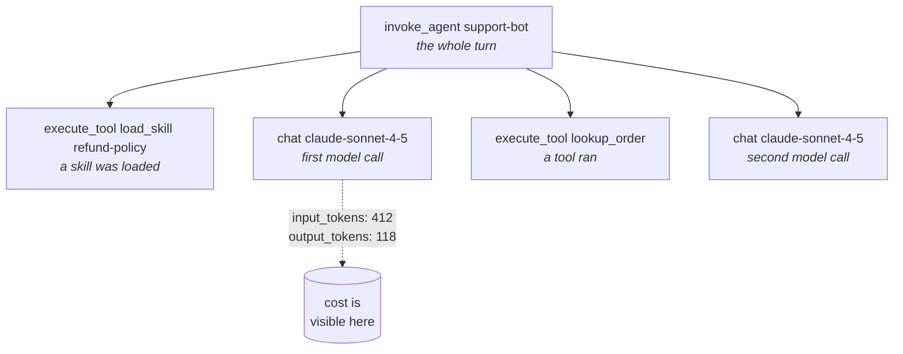

# Agent Tracing — seeing what your agent actually did

<!-- cspell:ignore systm -- a deliberate misspelling, shown below as the example of a typo that fails silently. Deliberately NOT added to .github/cspell.json: allowing it everywhere would let a real typo through. -->

Normal code is easy to debug because you can run it again and get the same
answer. **An agent is not like that.** Give it the same question twice and you
can get two different runs: a different tool called, a different file read, a
different reply.

So you cannot debug an agent by reproducing the problem. You have to record the
run *while it is happening*, and then read the recording. That recording is
called a **trace**.

This guide shows you how to make those recordings in a standard way, so any
tool can read them. It also introduces the
[Agent Tracing skill](#-install-the-skill) and the `check-semconv` gate, which
catches the one mistake that silently ruins tracing.

> **New here?** [Evaluation & Observability](./evaluation-and-observability.md)
> explains *why* you measure agents at all. This guide is the *how* for the
> tracing half. Unfamiliar word? Try the [Glossary](../GLOSSARY.md).

---

## 🎯 Why this guide exists

Teams add tracing, look at the dashboard, see nothing, and conclude tracing is
not worth it. Usually the tracing was fine and **one attribute name was wrong**.

Here is the whole problem in one picture:

```text
   Your code                    Collector               Your dashboard
  ───────────                  ───────────              ──────────────
  "gen_ai.systm"    ────────▶   accepted     ────────▶   panel is EMPTY
   (a typo)                     and stored                     │
                                                               │
          "I guess the agent never ran"  ◀─────────────────────┘
                   (the wrong conclusion)
```

Nothing errors. The span is still sent. The collector still accepts it. The
backend still stores it. The only symptom is an empty panel — and an empty
panel because *nothing happened* looks exactly like an empty panel because
*the name was misspelled*.

This is why the first thing you do is run a name check, not read the code.

---

## 📐 What a trace of an agent looks like

A trace is a tree of **spans**. One span is one thing that took time. The shape
matters more than the detail: if the shape is wrong, no amount of extra
attributes will fix it.



Read that top to bottom and you can answer the three questions people actually
ask about an agent:

| Question | Where the answer is |
| :--- | :--- |
| *Why did it do that?* | The skill and tool spans — what it loaded and called |
| *Why was it slow?* | Span durations — usually one model call, or a tool waiting |
| *Why did it cost that much?* | The token counts on each `chat` span |

---

## 🧱 The standard: OpenTelemetry GenAI semantic conventions

You could invent your own attribute names. Don't. There is a shared vocabulary
— the **OpenTelemetry GenAI semantic conventions** — and using it means any
OTLP-compatible backend understands your spans without configuration.

The names all start with `gen_ai.`. The ones you will use constantly:

| Attribute | What goes in it |
| :--- | :--- |
| `gen_ai.operation.name` | What kind of thing this span is (`chat`, `invoke_agent`, `execute_tool`, …) |
| `gen_ai.provider.name` | Who provides the model (`anthropic`, `openai`, …) |
| `gen_ai.request.model` | The model you asked for |
| `gen_ai.response.model` | The model that actually answered |
| `gen_ai.usage.input_tokens` | Tokens in |
| `gen_ai.usage.output_tokens` | Tokens out |
| `gen_ai.usage.cache_read.input_tokens` | Tokens served from cache — much cheaper |
| `gen_ai.conversation.id` | Ties every span of one conversation together |

`gen_ai.operation.name` accepts **only** these values:

`chat` · `create_agent` · `embeddings` · `execute_tool` · `generate_content` ·
`invoke_agent` · `invoke_workflow` · `plan`

> [!WARNING]
> **These conventions are not finished.** Every GenAI span and attribute is
> marked `Development` status. They were moved out of OpenTelemetry's main
> `semantic-conventions` repository into
> [`semantic-conventions-genai`](https://github.com/open-telemetry/semantic-conventions-genai),
> which has **no tagged release at all**. So names still change. Pin the
> snapshot you instrument against and expect to revisit it — this repo's gate
> pins a date for exactly that reason.

### Tracing skill loads — the new part

The conventions recently gained first-class attributes for **Agent Skills**.
This matters if your agent uses skills, because without these spans two very
different situations look identical in a trace:

```text
  "the agent behaved oddly"
  "the agent loaded a skill that told it to behave that way"
```

| Attribute | What goes in it |
| :--- | :--- |
| `gen_ai.skill.name` | The skill's `name` |
| `gen_ai.skill.description` | The skill's `description` — this is what made the agent pick it |
| `gen_ai.skill.source.uri` | Where the skill came from |
| `gen_ai.skill.resource.name` | A file inside the skill (a script, reference or asset) |

This cookbook [publishes skills](../README.md#-installable-skills), so being
able to see *which* skill fired is not a theoretical nicety here.

---

## 🚦 The gate: `check-semconv`

The gate answers one question, mechanically: **are these attribute names real?**
No model, no network, no API key — so it is safe in CI and behaves identically
on macOS, Windows and Linux.

```bash
# macOS and Linux
node scripts/check-semconv.js src --strict
```

```powershell
# Windows (PowerShell)
node scripts\check-semconv.js src --strict
```

| Check | Why it matters | Level |
| :--- | :--- | :--- |
| The attribute is one the conventions define | A typo is invisible at runtime | **error** |
| The attribute has not been renamed | Older code and tutorials are full of old names | **error** |
| `gen_ai.operation.name` holds a valid value | An invalid value breaks grouping in every backend | **error** |
| Token counts are recorded | Otherwise a trace says *something happened*, not what it cost | warning |
| User content is being recorded | Prompts and replies end up in your telemetry backend | warning |

Only unambiguous mistakes are errors. A misspelled attribute has no correct
reading; recording a prompt might be exactly right or exactly wrong depending
on your retention rules, so that is a warning asking for a decision.

### The renames that actually bite

| Old name | Use instead |
| :--- | :--- |
| `gen_ai.system` | `gen_ai.provider.name` |
| `gen_ai.usage.prompt_tokens` | `gen_ai.usage.input_tokens` |
| `gen_ai.usage.completion_tokens` | `gen_ai.usage.output_tokens` |
| `gen_ai.prompt` | `gen_ai.input.messages` |
| `gen_ai.completion` | `gen_ai.output.messages` |
| `gen_ai.usage.total_tokens` | **nothing** — it never existed. Add input + output yourself |
| `gen_ai.openai.request.seed` | `gen_ai.request.seed` |

That last-but-one is worth a pause: several frameworks emit
`gen_ai.usage.total_tokens` even though the conventions never defined it. If
you are grouping cost by it, you are grouping by an attribute half your tools
do not send.

### The escape hatch

A document or comment that warns you off an old name has to be able to **write
it down**. Mark the line, the line above, or a whole fenced block:

```js
// Not the old gen_ai.system name. semconv-allow
span.setAttribute("gen_ai.provider.name", "anthropic");
```

It is a visible marker on purpose, and it names nothing broader than the line
it sits on — silencing a check should not be something you can do quietly.

### Watch it catch something

The example this repo ships is checked by this repo's own CI, so the code you
copy always passes. Break it on purpose to see the gate work:

```bash
# macOS and Linux
cp templates/tracing/instrumentation.example.js /tmp/t.js
printf 'span.setAttribute("gen_ai.usage.prompt_tokens", 10);\n' >> /tmp/t.js
node scripts/check-semconv.js /tmp/t.js
```

```powershell
# Windows (PowerShell)
Copy-Item templates\tracing\instrumentation.example.js $env:TEMP\t.js
Add-Content $env:TEMP\t.js 'span.setAttribute("gen_ai.usage.prompt_tokens", 10);'
node scripts\check-semconv.js $env:TEMP\t.js
```

It should exit 1 and tell you to use `gen_ai.usage.input_tokens`.

---

## 📥 Install the skill

```bash
npx ai-engineering-cookbook agent-tracing
```

That installs `SKILL.md`, the `check-semconv.js` gate and the worked example.
To target a different agent, or to see what would happen first:

```bash
npx ai-engineering-cookbook agent-tracing --tool cursor
npx ai-engineering-cookbook agent-tracing --dry-run
```

The same commands work on macOS, Windows and Linux — see
[Installation](./installation.md) for the full environment table.

---

## 🔒 Before you ship: the content decision

These attributes hold **user and model content**, not metadata:

`gen_ai.input.messages` · `gen_ai.output.messages` ·
`gen_ai.system_instructions` · `gen_ai.tool.call.arguments` ·
`gen_ai.tool.call.result` · `gen_ai.retrieval.documents` ·
`gen_ai.memory.records`

Recording them is often the entire reason you wanted a trace. It also means
real prompts, real replies and real retrieved documents land in a telemetry
backend that usually **more people can read** than the application itself,
under a retention period nobody picked deliberately.

Make it a decision, not a default:

- redact before export (emails, card numbers, tokens), **or**
- shorten retention on the telemetry backend, **or**
- do not record content, and keep only the metadata and counts.

The gate warns on these attributes so the choice shows up in review rather than
in an incident.

---

## 🧰 Choosing a backend

Because these are ordinary OpenTelemetry spans, you are not locked in. Rough
guidance rather than a ranking:

| You want | Reasonable choice |
| :--- | :--- |
| Self-hosted, permissive licence, prompt management too | [Langfuse](https://github.com/langfuse/langfuse) (MIT) |
| OpenTelemetry-native, with embedding and drift views | [Arize Phoenix](https://github.com/Arize-ai/phoenix) — but see the note below |
| You already run OpenTelemetry | Your existing collector. Nothing special needed |
| Regression gates in CI, not dashboards | [promptfoo](https://github.com/promptfoo/promptfoo) — alongside tracing, not instead of it |

> [!IMPORTANT]
> **Check the licence before you commit.** "Open source" is doing a lot of work
> in most comparison tables. Arize Phoenix is under the **Elastic License 2.0**,
> which is not an OSI-approved open-source licence. Langfuse is MIT but is now
> owned by ClickHouse. Neither fact is disqualifying; both are things you want
> to know before building a platform on top.

---

## ⚠️ What tracing does *not* give you

Four limits worth stating plainly, because overselling observability is how
teams end up with dashboards nobody trusts.

1. **A trace is not an evaluation.** It tells you what happened on one run. It
   says nothing about whether the answer was *good*. You need both, and they
   answer different questions — see
   [Evaluation & Observability](./evaluation-and-observability.md).
2. **The gate checks names, not correctness.** It cannot tell you a parent span
   is missing, that your spans nest wrongly, or that the value in an attribute
   is the right one. Green means *spelled correctly*.
3. **The gate only sees literal strings.** A name built at runtime
   (`"gen_ai.usage." + kind`) is invisible to it.
4. **The conventions will change under you.** They are pre-stable, in a
   repository with no releases. Treat the pinned snapshot as something you
   review, not something that stays true.

---

## 🧭 Next Steps

| You want to... | Go to |
| :--- | :--- |
| Understand why you measure agents at all | [Evaluation & Observability](./evaluation-and-observability.md) |
| Understand what skills, AGENTS.md and MCP each are | [Agent Standards](./agent-standards.md) |
| Vet a skill before you install it | [Skill Review](./skill-review.md) |
| Keep your docs from contradicting each other | [Doc Coherence](./doc-coherence.md) |
| Look up a term | [Glossary](../GLOSSARY.md) |
