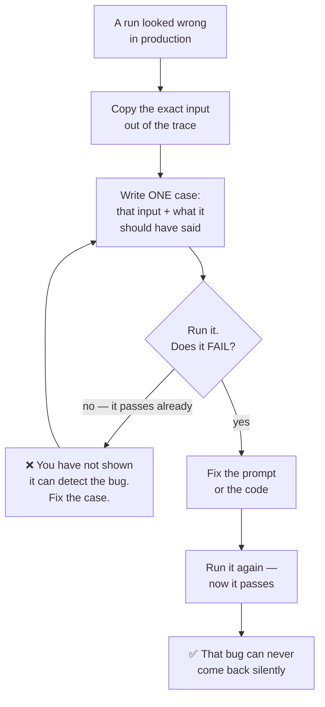

# Eval Harness — building a test suite for things that are not exactly right or wrong

A unit test asks "is `2 + 2` equal to `4`?" and gets a clean yes or no. An LLM feature is not like that. Ask a model the same question twice and you may get two different sentences, both correct. So how do you write a test for it?

That is what an **eval suite** is. This guide explains how to build one, how to tell a real one from a fake one, and how to make it block a bad merge.

> **The one-sentence version:** an eval suite that cannot fail is worse than no eval suite at all — no suite is an honest "we don't measure this", but a suite that always passes is a green tick people trust.

This guide assumes no prior AI experience. If a word is unfamiliar, check the [Glossary](../GLOSSARY.md).

---

## 🧭 Where this sits

[Evaluation & Observability](./evaluation-and-observability.md) explains **why** you need evals and how they differ from traces. This guide is the **how**: the dataset, the threshold, the CI job, and the gate that checks your suite is real.

| You want to... | Read |
| :--- | :--- |
| Understand traces vs evals, and OpenTelemetry | [Evaluation & Observability](./evaluation-and-observability.md) |
| Actually build a suite today | This guide |
| Have an agent do it with you | The [Eval Harness skill](#-install-the-skill) |

---

## 😬 The problem, honestly

Most teams building with models end up here:

```text
  "Did that prompt change make things better or worse?"
              ↓
  "...I think better? It looked better on the three
   examples I tried."
              ↓
  ship it
              ↓
  a customer finds the fourth example
```

Survey after survey finds the same imbalance: teams adopt tracing quickly, and far fewer ever run evals. Tracing is easy — install an SDK and dashboards appear. Evals require you to decide what "good" means and write it down. That is real work, and it is the work that actually stops regressions.

---

## 🧱 What an eval suite is made of

Three things. That is all.

```text
┌──────────────────────────────────────────────────┐
│  1. A DATASET                                    │
│     inputs + what a good answer looks like       │
│     ~10-20 cases, taken from real runs           │
├──────────────────────────────────────────────────┤
│  2. A THRESHOLD                                  │
│     "90% of cases must pass"   →  0.9            │
│     the line between green and red               │
├──────────────────────────────────────────────────┤
│  3. A CI JOB                                     │
│     runs on every change, and BLOCKS the merge   │
└──────────────────────────────────────────────────┘
```

Miss any one and you do not have a gate. A dataset with no threshold reports a number nobody acts on. A threshold with no CI job is a preference. A CI job that does not block is a dashboard.

---

## 📋 Step 1 — Write the dataset

An eval dataset is plain JSON: a list of inputs, each paired with what a good answer contains.

```json
{
  "threshold": 0.9,
  "cases": [
    {
      "id": "refund-window-states-30-days",
      "input": "How long do I have to return an item?",
      "expected_contains": ["30 days"],
      "must_not_contain": ["90 days", "no returns"]
    },
    {
      "id": "refund-gift-offers-store-credit",
      "input": "Can I return a gift without a receipt?",
      "expected_contains": ["store credit"],
      "must_not_contain": ["cash refund"]
    }
  ]
}
```

A complete, working example ships with this repo at [`templates/evals/customer-support.example.json`](../templates/evals/customer-support.example.json). It is checked by this repo's own CI on every run, so the example you copy is always one that passes.

### The keys you can use

| Key | Means | Cost |
| :--- | :--- | :--- |
| `id` | A short, stable name. This is what a CI failure prints — make it searchable | — |
| `input` | Exactly what the model receives | — |
| `expected_contains` | Every string that must appear in the answer | Free |
| `must_not_contain` | Every string that must **not**. This is where regressions get caught | Free |
| `expected_equals` | The whole answer, when the output is a fixed string | Free |
| `expected_regex` | A pattern the answer must match. Double your backslashes inside JSON | Free |
| `expected_json_schema` | For an answer that must be valid structured data | Free |
| `rubric` | A sentence an **LLM judge** scores against | Slow, costs money, can be wrong |
| `threshold` | Top level. The fraction of cases that must pass, `0` to `1` | — |

### Where the cases come from

This is the part that decides whether your suite is worth anything.



The step people skip is **"does it fail?"**. A case added *after* the fix, which passes the moment you write it, proves nothing. This is the RED step of [test-driven development](../GLOSSARY.md), applied to prompts.

> [!TIP]
> Name the case after the bug, not the topic. `refund-window-said-90-days` tells a future reader what went wrong. `refund-test-7` does not.

Ten real cases beat a thousand invented ones. If you have no traces yet, say so out loud — cases invented without production evidence are a starting point, not a suite.

---

## 🪜 Step 2 — Pick the cheapest scorer that works

Scorers come in three levels. **Always try the cheapest first**, and only move up when the level below genuinely cannot express the check.

```text
LEVEL 1 — DETERMINISTIC          fast · free · never wrong
  ├─ expected_contains, must_not_contain, expected_equals,
  │  expected_regex, expected_json_schema
  └─ use for: required facts, forbidden phrases, formats
        ↓ only if Level 1 genuinely cannot express it
LEVEL 2 — STATISTICAL            fast · free · fuzzy
  ├─ similarity to a reference answer, keyword overlap
  └─ use for: "roughly the same meaning"
        ↓ only if Level 2 genuinely cannot express it
LEVEL 3 — LLM-AS-JUDGE           slow · costs money EVERY run · can be wrong
  ├─ rubric
  └─ use for: tone, helpfulness, reasoning quality
```

Most people reach straight for Level 3 because it feels powerful. A check that the answer contains `30 days` is free, instant, and never has an opinion.

> [!WARNING]
> An **uncalibrated judge does not measure quality — it measures the judge.** Judges are systematically optimistic; they hand out passes too readily. If you use `rubric` anywhere, calibrate it: have a human label ~50 outputs pass/fail, run the judge on the same 50, and compare. If agreement is poor, fix the *judge's* prompt and repeat. Ask for a **binary verdict**, not a score out of ten — scores drift between runs.

---

## 🎯 Step 3 — Set a threshold, not a vibe

```json
"threshold": 0.9
```

That means "90% of cases must pass". Write it as a fraction — `0.9`, never `90`.

How to choose the number:

- **Start at the pass rate you get today**, once the suite is written. That makes the gate a regression detector from day one, with no argument about what the bar "should" be.
- **Raise it deliberately**, in its own commit, when you improve the feature.
- **Never lower it to make a red build green.** Lowering the threshold to pass is the same move as deleting a failing test. If the bar genuinely should drop, say so out loud and let a human decide.

---

## 🚦 Step 4 — Make it block the merge

The suite belongs in **Gate 1** alongside lint and unit tests, because it is the same kind of thing: an automated check that either passes or fails. (This repository's four gates are defined in [`.ai/config/VERIFICATION_AND_EVAL_GUIDE.md`](../.ai/config/VERIFICATION_AND_EVAL_GUIDE.md), which owns those definitions — this guide does not redefine them.)

```text
GATE 1 — Automated Checks
  ├─ lint            ← already there
  ├─ tests           ← already there
  ├─ secret scan     ← already there
  ├─ eval gate       ← check the suite CAN fail   (milliseconds, no API key)
  └─ eval run        ← score it                   (slow, needs a key)
```

Run the **gate** before the **run**. It costs milliseconds and no API calls, and it is the step that tells you whether the expensive step meant anything.

```yaml
# .github/workflows/evals.yml — the shape, not a drop-in file
- name: Check the eval suite is capable of failing
  run: node scripts/check-evals.js evals --strict

- name: Run the evals
  run: npx promptfoo@latest eval
  env:
    MY_PROVIDER_API_KEY: ${{ secrets.MY_PROVIDER_API_KEY }}
```

---

## 🔍 The gate: is this suite real, or theatre?

A suite stops being able to fail in ways that are invisible when you read it and obvious to a machine. `scripts/check-evals.js` looks for exactly those.

```bash
# macOS and Linux
node scripts/check-evals.js evals --strict
```

```powershell
# Windows (PowerShell) — same command, only the path separator differs
node scripts\check-evals.js evals --strict
```

```text
:: Windows (cmd.exe)
node scripts\check-evals.js evals --strict
```

| Exit code | Meaning | What you do |
| :---: | :--- | :--- |
| `0` | The suite is capable of failing | Trust a green run |
| `1` | Problems found | Fix each one first |
| `2` | Bad path, or no dataset there | Fix the path — **this is not a pass** |

### What it checks

| Check | Why it matters |
| :--- | :--- |
| Every case has an **assertion** | A case with none passes against *any* output, including an empty string |
| A **threshold** is declared, and is a fraction | No threshold means nothing defines failure. `90` instead of `0.9` is the classic typo |
| Every case has a unique **`id`** | Most runners silently keep only the last case with a given id — so a duplicate id deletes a test |
| Every case has a non-empty **`input`** | Nothing to send to the model |
| No **contradictory** assertions | The same string required *and* forbidden is a case that can never pass |
| Every **regex compiles** | A broken pattern errors instead of scoring, and some runners count an error as a pass |
| Assertion arrays are **arrays of strings** | A bare string is the most common typo; runners iterate it character by character |
| No **duplicate inputs** | Two identical cases cost twice the tokens and catch one bug |
| No **placeholder text** (`TODO`, `TBD`, …) | A dataset of stubs passes trivially and reads like a real suite |
| No **credentials** | Datasets are built from real runs and committed to git, where a key lives forever |
| Not **judge-only** | A suite scored entirely by an LLM is slow, costs money per run, and inherits the judge's mistakes |

The last four are warnings, not errors — use `--strict` to make them block too. Add `--json` when another program reads the result, and `--min-cases <n>` to change the size warning (default 10).

> [!NOTE]
> The gate **never calls a model and never runs your evals.** It checks the suite is capable of failing. A green gate plus a green eval run is the signal; the gate on its own is not.

---

## 🧰 Install the skill

The [Eval Harness skill](../skills/eval-harness/SKILL.md) teaches your coding agent to do all of the above with you — build a suite, review an existing one, or turn a bad production run into a permanent case.

```bash
# macOS and Linux
npx ai-engineering-cookbook eval-harness
```

```powershell
# Windows (PowerShell)
npx ai-engineering-cookbook eval-harness
```

That installs the `SKILL.md`, the `check-evals.js` gate, and the example dataset. Use `--tool cursor` (or `codex`, `vscode`, `antigravity`, `roo`, `others`) to target a different agent — see [Installation](./installation.md) for the full matrix, and `--dry-run` to see what it would write without writing anything.

Then ask your agent something like:

> *"Use the eval-harness skill to build an eval suite for the support-reply feature."*

---

## 🧯 Honest limits

Worth knowing before you rely on this:

- **It scores outputs, not trajectories.** Checking that an agent took a sensible *path* — called the right tools, in a sensible order, without looping — is a different and harder problem. This dataset shape does not express it.
- **Deterministic checks are literal.** `expected_contains: ["30 days"]` does not match "thirty days". That literalness is exactly why they never flake, but you are testing wording as well as meaning. Where wording is genuinely free, move up the ladder — do not weaken the check to `"days"`.
- **A dataset ages.** When the policy it encodes changes, the cases become wrong, and a suite of wrong cases is worse than none. Re-read it whenever the thing it describes changes.
- **The eval tooling layer is consolidating.** Pick the tool whose *self-hosted* path you have actually run — see the tooling table in [Evaluation & Observability](./evaluation-and-observability.md#-the-tooling-landscape), including the ownership changes noted there.

---

## 🎨 See it visually

The [Interactive Cookbook Explorer](https://exponen-agi.github.io/ai-engineering-cookbook/design/cookbook-explorer.html) shows where evaluation sits in the wider stack.

---

## 🧭 Next Steps

- [Evaluation & Observability](./evaluation-and-observability.md) — traces vs evals, and OpenTelemetry GenAI.
- [Skill Review](./skill-review.md) — vetting a `SKILL.md` before you trust it.
- [Agent Security](./agent-security.md) — why a dataset full of real runs is also a data-handling problem.
- [Glossary](../GLOSSARY.md) — plain-English definitions for every term used here.
- [Back to the main README](../README.md).
