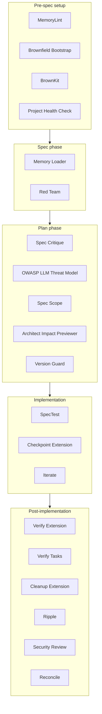

# Curated Community Extensions Guide

This guide covers 20 community extensions selected from the
[Spec-Kit community catalog](https://speckit-community.github.io/extensions/all-extensions).
Each one plugs into a specific step of the Spec-Kit workflow — from
`/speckit-constitution` through `/speckit-implement` and `/speckit-converge` — to
add security checks, catch scope creep, generate test scaffolds and find side
effects.

> [!NOTE]
> Every extension below is a third-party project, MIT-licensed, and maintained
> by its own author — not by Spec-Kit and not by this cookbook. Read an
> extension's page and source before you install it, the same way you would
> review a skill (see [Skill Review](./skill-review.md)). Descriptions here were
> checked against each catalog page in October 2026; the page is the source of
> truth if they differ.

---

## 📦 Installing an extension

Each catalog page has an **Install** box with the exact command. They all
follow the same pattern:

```bash
specify extension add <id> --from <release-zip-url>
```

The `<id>` is the last part of the catalog URL (for example `verify-tasks`), and
the zip URL points at a tagged release in the extension's own repository. Copy
it from the catalog page rather than guessing the version — release tags move.

Each extension then adds its own commands, named `speckit.<id>.<command>`. Type
them with the same prefix as the core steps — `/speckit-...`, `$speckit-...` or
`/skill:speckit-...` depending on your agent — see
[Installation](./installation.md#the-prefix-depends-on-your-agent).

---

## 🗺️ Extension Placement Map

The diagram below shows where each extension fits in the workflow.



---

## 📦 Extension Directory Tables

Each extension name links to its catalog page; **Source** links to its
repository. *Fit* is **GF** (greenfield), **BF** (brownfield) or **Both**.

### 1. Pre-Spec & Setup Extensions

Run these before you write a spec, to give the agent an accurate picture of the
project.

| Extension | What it does | Fit | Where in Workflow | Skip When | Source |
| :--- | :--- | :---: | :--- | :--- | :--- |
| **[MemoryLint](https://speckit-community.github.io/extensions/memorylint)** | Audits agent instruction files (`AGENTS.md`, `CLAUDE.md`, the constitution, `.cursor/rules`) for conflicting, redundant or out-of-date rules, with evidence for each finding. | Both | After editing `constitution.md` or any agent instruction file | Day 0 of a greenfield project — there is nothing to audit yet | [repo](https://github.com/RbBtSn0w/spec-kit-extensions) |
| **[Brownfield Bootstrap](https://speckit-community.github.io/extensions/brownfield)** | Scans an existing codebase to discover its architecture, writes a constitution tailored to it, and moves features into spec-driven development one at a time. | BF | Before `/speckit-constitution` | The codebase is small enough to describe yourself | [repo](https://github.com/Quratulain-bilal/spec-kit-brownfield) |
| **[BrownKit](https://speckit-community.github.io/extensions/brownkit)** | Evidence-based discovery of what an existing codebase does, with a security and QA risk assessment of each capability. | BF | After Brownfield Bootstrap, before the constitution | A low-risk internal tool with no security profile | [repo](https://github.com/MaksimShevtsov/BrownKit) |
| **[Project Health Check](https://speckit-community.github.io/extensions/doctor)** | Checks that a Spec-Kit project is set up correctly: folder structure, agent configuration, features, scripts, extensions and git. | Both | When a Spec-Kit command behaves oddly, or before a new feature | You set up the project minutes ago | [repo](https://github.com/KhawarHabibKhan/spec-kit-doctor) |

---

### 2. Spec Phase Extensions

Run these around `/speckit-specify` and `/speckit-clarify`, before
`/speckit-plan`, to harden the spec.

| Extension | What it does | Fit | Where in Workflow | Skip When | Source |
| :--- | :--- | :---: | :--- | :--- | :--- |
| **[Memory Loader](https://speckit-community.github.io/extensions/memory-loader)** | Reads every file in `.specify/memory/` before each Spec-Kit command, so the agent always has your constitution and governance rules in context. Read-only. | Both | Runs automatically before every `/speckit-*` step | Your agent already loads these files at session start | [repo](https://github.com/KevinBrown5280/spec-kit-memory-loader) |
| **[Red Team](https://speckit-community.github.io/extensions/red-team)** | Runs 3–5 adversarial reviewers in parallel against a finished spec to find gaps, ambiguities and abuse cases. Can be made a required gate before planning. | Both | After specify/clarify, before plan | Minor bug fixes or cosmetic refactors | [repo](https://github.com/ashbrener/spec-kit-red-team) |

---

### 3. Plan Phase Extensions

Run these after `/speckit-plan` and before `/speckit-implement`, to catch
risks while they are still cheap to fix.

| Extension | What it does | Fit | Where in Workflow | Skip When | Source |
| :--- | :--- | :---: | :--- | :--- | :--- |
| **[Spec Critique](https://speckit-community.github.io/extensions/critique)** | Reviews the spec and plan twice — once as a product reviewer, once as an engineering-risk reviewer. | Both | After `/speckit-plan`, before `/speckit-tasks` | Time-boxed spikes where the spec is deliberately incomplete | [repo](https://github.com/arunt14/spec-kit-critique) |
| **[OWASP LLM Threat Model](https://speckit-community.github.io/extensions/threatmodel)** | Checks your spec artifacts against the OWASP Top 10 for LLM Applications and writes a risk-rated report. Read-only. | Both | After `/speckit-plan` | The app does not call, route or consume LLMs | [repo](https://github.com/NaviaSamal/spec-kit-threatmodel) |
| **[Spec Scope](https://speckit-community.github.io/extensions/scope)** | Estimates effort from the spec artifacts, budgets time per phase, and detects scope creep by comparing specs against git history. | Both | After `/speckit-tasks`; again mid-feature to check for creep | Rapid prototypes where scope is deliberately open | [repo](https://github.com/Quratulain-bilal/spec-kit-scope-) |
| **[Architect Impact Previewer](https://speckit-community.github.io/extensions/architect-preview)** | Predicts the architectural impact, complexity and risks of the planned changes before any code is written. | Both | After `/speckit-tasks`, before `/speckit-implement` | Simple features with no cross-cutting concerns | [repo](https://github.com/UmmeHabiba1312/spec-kit-architect-preview) |
| **[Version Guard](https://speckit-community.github.io/extensions/version-guard)** | Checks your locked npm package versions against the live registry before planning, so the plan targets versions that actually exist, then validates the generated code. | Both | Before and after `/speckit-plan` | Projects that do not use npm | [repo](https://github.com/KevinBrown5280/spec-kit-version-guard) |

---

### 4. Implementation Phase Extensions

Use these while `/speckit-implement` runs the tasks — the TDD loop
(`RED → GREEN → REFACTOR`).

| Extension | What it does | Fit | Where in Workflow | Skip When | Source |
| :--- | :--- | :---: | :--- | :--- | :--- |
| **[SpecTest](https://speckit-community.github.io/extensions/spectest)** | Generates test scaffolds from the acceptance criteria in `spec.md`, maps coverage to each requirement, and lists the gaps. | Both | Before `/speckit-implement`, so each task starts with its failing test | Simple tasks where you can write the test yourself | [repo](https://github.com/Quratulain-bilal/spec-kit-spectest) |
| **[Checkpoint Extension](https://speckit-community.github.io/extensions/checkpoint)** | Has the agent commit after each workflow step and during implementation, instead of one large commit at the end — so any point is easy to roll back to. | Both | During `/speckit-implement` | Tasks so small the extra commits are noise | [repo](https://github.com/aaronrsun/spec-kit-checkpoint) |
| **[Iterate](https://speckit-community.github.io/extensions/iterate)** | A two-step define-then-apply workflow for changing the spec mid-implementation, then returning to implement without losing completed work. | Both | When requirements change during implementation | The spec is stable | [repo](https://github.com/imviancagrace/spec-kit-iterate) |

---

### 5. Post-Implementation & Review Extensions

Run these once the tasks are done — alongside `/speckit-converge` — before the
branch is merged.

| Extension | What it does | Fit | Where in Workflow | Skip When | Source |
| :--- | :--- | :---: | :--- | :--- | :--- |
| **[Verify Extension](https://speckit-community.github.io/extensions/verify)** | A read-only quality gate that checks the code against the spec, plan, tasks and constitution in seven categories. | Both | After the final task, before review | Non-production prototypes | [repo](https://github.com/ismaelJimenez/spec-kit-verify) |
| **[Verify Tasks](https://speckit-community.github.io/extensions/verify-tasks)** | Finds *phantom completions* — tasks ticked `[X]` in `tasks.md` that were never actually implemented. | Both | Before merging the branch | The task list is short enough to audit by hand in a minute | [repo](https://github.com/datastone-inc/spec-kit-verify-tasks) |
| **[Cleanup Extension](https://speckit-community.github.io/extensions/cleanup)** | A post-implementation gate: fixes small issues itself, adds tasks for medium ones, writes up large ones, and stops on anything critical. | Both | After `/speckit-implement` | Changes of a few lines | [repo](https://github.com/dsrednicki/spec-kit-cleanup) |
| **[Ripple](https://speckit-community.github.io/extensions/ripple)** | Finds side effects that tests miss, each tied to a specific line of the diff, across nine categories. Especially useful in legacy code. | Both | After all tasks are complete | Greenfield code that nothing depends on yet | [repo](https://github.com/chordpli/spec-kit-ripple) |
| **[Security Review](https://speckit-community.github.io/extensions/security-review)** | Secure-by-design review of the whole repository, staged changes, a branch or PR, or the plan and tasks — with follow-up and fix commands. | Both | Before merging the branch (and optionally on the plan) | Internal prototypes or simple styling changes | [repo](https://github.com/DyanGalih/security-review) |
| **[Reconcile](https://speckit-community.github.io/extensions/reconcile)** | Updates the feature's `spec.md` and `plan.md` to match the code that actually shipped, and appends remediation tasks, from a plain-language gap report. | Both | After `/speckit-converge`, when the code and the spec have drifted apart | The spec still describes the code accurately | [repo](https://github.com/stn1slv/spec-kit-reconcile) |

---

## 🛠️ Situation-Based Decision Matrix

Use this matrix to quickly select which extensions to run on a new feature or project:

| If your situation is... | Add these extensions... |
| :--- | :--- |
| **Starting a new brownfield project** | `Brownfield Bootstrap` → `BrownKit` → `MemoryLint` |
| **Building an LLM/RAG application** | `OWASP LLM Threat Model` + `Security Review` |
| **Requirements changed in the middle of coding** | `Iterate` |
| **Working in a complex legacy codebase** | `Ripple` + `Architect Impact Previewer` |
| **Worried the agent skipped tasks** | `Verify Tasks` |
| **The code shipped, but the spec no longer describes it** | `Reconcile` |
| **Spec-Kit commands behave oddly** | `Project Health Check` |

---

## 🚀 Quick-Start Extension Sets

Copy these pre-configured extension sets for common project types:

### Minimal (New Greenfield Project)

No extensions needed for day 1. Add `SpecTest` after your first spec is approved.

### Standard (Most Projects)

`MemoryLint` → `Spec Critique` → `Version Guard` → `SpecTest` → `Verify Tasks` → `Security Review`

### High-Security (LLM / Fintech / Healthcare)

`MemoryLint` → `Red Team` → `Spec Critique` → `OWASP LLM Threat Model` → `Version Guard` → `SpecTest` → `Checkpoint Extension` → `Verify Extension` → `Security Review`

### Legacy Brownfield

`Brownfield Bootstrap` → `BrownKit` → `Project Health Check` → `MemoryLint` → `Red Team` → `Spec Critique` → `Architect Impact Previewer` → `Ripple` → `Verify Tasks` → `Reconcile`

---

### 📖 Next Steps

- Learn how to install uv and tools: [Installation Guide](./installation.md)
- Walk through a greenfield project: [Greenfield Guide](./greenfield.md)
- View the 5-minute setup cheatsheet: [Quickstart Guide](../QUICKSTART.md)
- Hit a problem? Check the [Troubleshooting Guide](./troubleshooting.md)
