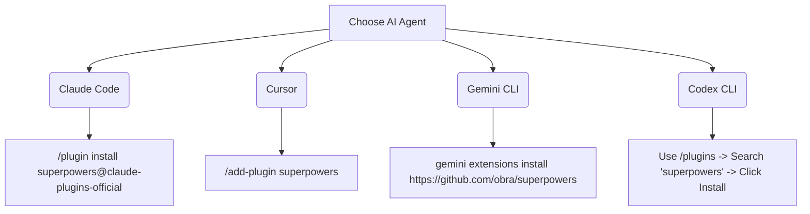

# Installation and Setup Guide

This guide walks you through setting up the AI-Native SDLC environment on your machine. We will set up **Spec-Kit** for planning and **Superpowers** for execution.

---

## 🛠 Prerequisites

Before installing the tools, make sure you have the following installed on your system:

- **Git**: Active version control.
- **Node.js** (v22 or higher): Required if you are developing Node-based applications, and to run this repository's own checks. Node 18 and Node 20 have both reached end-of-life and no longer receive security fixes — see [Toolchain & Node Baseline](./toolchain.md).
- **Python** (v3.10 or higher): Required for Spec-Kit.

---

## 🖥️ Which commands differ by platform

Almost nothing here does, and it is worth saying so plainly rather than leaving Windows readers to guess.

| Command | macOS | Linux | Windows (PowerShell) |
| :--- | :---: | :---: | :---: |
| Installing `uv` | \* | \* | **different — use the PowerShell line below** |
| Reloading `PATH` after install | not needed | not needed | **different — see the note in step 1** |
| `uv --version`, `uv tool install …` | same | same | same |
| `specify --version`, `specify init …` | same | same | same |
| `mkdir`, `cd` | same | same | same |
| `npx ai-engineering-cookbook …` | same | same | same |

\* macOS and Linux share the same `curl` installer line.

So: **type the `bash` blocks below exactly as written on all three platforms**, except the two rows marked different. Where a block genuinely differs, this guide shows both versions side by side.

> [!TIP]
> On Windows, prefer **PowerShell 7+** (`pwsh`) over the older Windows PowerShell 5.1, and avoid `cmd.exe` for these steps. PowerShell 7 supports `&&` between commands, which several blocks in this cookbook rely on.

---

## 📦 Step-by-step Installation

### 1. Install `uv` (Fast Python Package Manager)

Spec-Kit is distributed as a Python package. We recommend using `uv` to manage Python CLI tools because it is significantly faster and more isolated than standard `pip`.

```bash
# macOS and Linux
curl -LsSf https://astral.sh/uv/install.sh | sh

# Windows (PowerShell)
powershell -c "irm https://astral.sh/uv/install.ps1 | iex"
```

Verify that `uv` is installed:

```bash
uv --version
# Expected: uv x.y.z
```

> [!NOTE]
> **Windows users:** After installing `uv`, close and reopen your terminal before running `uv --version`. To reload the PATH without restarting, run:
>
> ```powershell
> $env:PATH = [System.Environment]::GetEnvironmentVariable("PATH","Machine") + ";" + [System.Environment]::GetEnvironmentVariable("PATH","User")
> ```

---

### 2. Install Spec-Kit

Use `uv` to install the Spec-Kit CLI tool globally. This ensures that the CLI and its dependencies are placed in an isolated, dedicated environment.

```bash
uv tool install specify-cli --from git+https://github.com/github/spec-kit.git
```

Verify that Spec-Kit is installed:

```bash
specify --version
# Expected: specify-cli x.y.z
```

---

### 3. Install Superpowers

Superpowers is installed directly inside your AI coding agent (e.g. Claude Code, Cursor, Gemini CLI).



> [!IMPORTANT]
> **Command accuracy:** Plugin install commands change as agents evolve. If the command above fails for your agent, check the [official Superpowers repository](https://github.com/obra/superpowers) for the latest install instructions for your specific agent version.

#### Verifying Superpowers Installation

After installing, type the following in your agent's chat interface to confirm it's active:

```
/sp-status
```

If Superpowers is installed correctly, you will see a list of available skills including `using-git-worktrees`, `test-driven-development`, and `requesting-code-review`.

---

## 🚀 Initializing Your Project

Once the tools are installed globally, you must initialize Spec-Kit in your project root directory.

### Scenario A: Greenfield Project (From Scratch)

If you are starting a completely new project in a blank directory, run:

```bash
mkdir my-new-project
cd my-new-project
specify init . --integration claude
```

> [!NOTE]
> Change `--integration claude` to matches your target agent (e.g. `gemini`, `copilot`, `cursor`).

### Scenario B: Brownfield Project (Existing Codebase)

If you are adding AI-assisted workflows to an existing project, navigate to the project directory and run:

```bash
cd my-existing-project
specify init . --force --integration claude
```

> [!IMPORTANT]
> The `--force` flag is safe to use. It only creates the `.specify/` directory structure and does not modify or delete any of your existing source files.

---

## 🔍 Verifying the Directory Structure

After initialization, you should see a new `.specify/` folder in your project root containing:

```
your-project/
└── .specify/
    ├── memory/
    │   └── constitution.md        # [Editable] Project principles & stack rules
    ├── specs/                     # Contains individual feature specs
    ├── templates/                 # Custom formatting templates
    └── scripts/                   # Integration bash/PowerShell scripts
```

If these files are present, you are successfully set up and ready to create your first specification!

---

### 📖 Next Steps

- Walk through a greenfield project from scratch: [Greenfield Guide](./greenfield.md)
- Walk through a brownfield project setup: [Brownfield Guide](./brownfield.md)
- Explore the AI Observability and Governance Layer: [AI Governance Guide](./governance.md)
- Ran into install problems? See the [Troubleshooting Guide](./troubleshooting.md)
