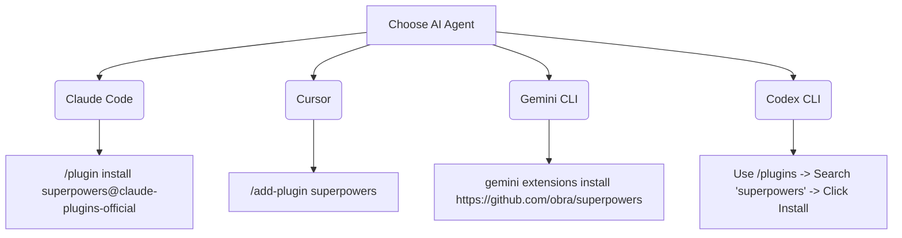

# Installation and Setup Guide

This guide walks you through setting up the AI-Native SDLC environment on your machine. We will set up **Spec-Kit** for planning and **Superpowers** for execution.

---

## 🛠 Prerequisites

Before installing the tools, make sure you have the following installed on your system:

- **Git**: Active version control.
- **Node.js** (v22 or higher): Required if you are developing Node-based applications, and to run this repository's own checks. Node 18 and Node 20 have both reached end-of-life and no longer receive security fixes — see [Toolchain & Node Baseline](./toolchain.md).
- **Python** (v3.11 or higher): Required for Spec-Kit. Checked against the Spec-Kit README on 2026-10-07.

---

## 📦 Step-by-step Installation

### 1. Install `uv` (Fast Python Package Manager)

Spec-Kit is distributed as a Python package. We recommend using `uv` to manage Python CLI tools because it is significantly faster and more isolated than standard `pip`.

```bash
# macOS and Linux
curl -LsSf https://astral.sh/uv/install.sh | sh

# Windows (PowerShell)
powershell -c "irm https://astral.sh/uv/install.ps1 | iex"
```

Verify that `uv` is installed:

```bash
uv --version
# Expected: uv x.y.z
```

> [!NOTE]
> **Windows users:** After installing `uv`, close and reopen your terminal before running `uv --version`. To reload the PATH without restarting, run:
>
> ```powershell
> $env:PATH = [System.Environment]::GetEnvironmentVariable("PATH","Machine") + ";" + [System.Environment]::GetEnvironmentVariable("PATH","User")
> ```

---

### 2. Install Spec-Kit

Use `uv` to install the Spec-Kit CLI tool globally. This ensures that the CLI and its dependencies are placed in an isolated, dedicated environment.

```bash
uv tool install specify-cli --from git+https://github.com/github/spec-kit.git
```

Verify that Spec-Kit is installed:

```bash
specify --version
# Expected: specify-cli x.y.z
```

---

### 3. Install Superpowers

Superpowers is installed directly inside your AI coding agent (e.g. Claude Code, Cursor, Gemini CLI).


```mermaid
graph TD
    A[Choose AI Agent] --> B(Claude Code)
    A --> C(Cursor)
    A --> D(Gemini CLI)
    A --> E(Codex CLI)

    B --> F["/plugin install superpowers@claude-plugins-official"]
    C --> G["/add-plugin superpowers"]
    D --> H["gemini extensions install https://github.com/obra/superpowers"]
    E --> I["Use /plugins -> Search 'superpowers' -> Click Install"]
```

> [!IMPORTANT]
> **Command accuracy:** Plugin install commands change as agents evolve. If the command above fails for your agent, check the [official Superpowers repository](https://github.com/obra/superpowers) for the latest install instructions for your specific agent version.

#### Verifying Superpowers Installation

After installing, type the following in your agent's chat interface to confirm it's active:

```
/sp-status
```

If Superpowers is installed correctly, you will see a list of available skills including `using-git-worktrees`, `test-driven-development`, and `requesting-code-review`.

---

## 🚀 Initializing Your Project

Once the tools are installed globally, you must initialize Spec-Kit in your project root directory.

### Scenario A: Greenfield Project (From Scratch)

If you are starting a completely new project in a blank directory, run:

```bash
mkdir my-new-project
cd my-new-project
specify init . --integration claude
```

> [!NOTE]
> Change `--integration claude` to matches your target agent (e.g. `gemini`, `copilot`, `cursor`).

### Scenario B: Brownfield Project (Existing Codebase)

If you are adding AI-assisted workflows to an existing project, navigate to the project directory and run:

```bash
cd my-existing-project
specify init . --force --integration claude
```

> [!IMPORTANT]
> The `--force` flag is safe to use. It only creates the `.specify/` directory structure and does not modify or delete any of your existing source files.

---

## ⌨️ How to invoke Spec-Kit in your agent

> [!IMPORTANT]
> **This is the one thing people get wrong.** Spec-Kit steps are **agent skills, not
> terminal commands**. You type them into your agent's chat window, never into a
> shell. And the **prefix is different in different agents** — if you copy a command
> from a blog post and nothing happens, this is almost always why.

### The prefix depends on your agent

`specify init` installs the steps into a folder your agent reads, then your agent
decides how they are invoked. Three prefixes are in use today:

| Prefix | Agents that use it | Example |
| :--- | :--- | :--- |
| `/speckit-<step>` | GitHub Copilot, Claude Code, Zed, Factory Droid, Devin, Grok Build, and most others | `/speckit-specify` |
| `$speckit-<step>` | OpenAI Codex CLI, ZCode, Command Code | `$speckit-specify` |
| `/skill:speckit-<step>` | Kimi Code | `/skill:speckit-specify` |

This guide writes the `/speckit-<step>` form everywhere because it is the most
common. **Substitute your agent's prefix from the table above.**

> [!NOTE]
> **Why you may see `/speckit.specify` with a dot elsewhere.** <!-- speckit-legacy-ok --> The dot form is the
> older *command* mode. Since the 0.16 release, `specify init` installs **skills**
> by default, and skills use a hyphen. The dot form still works, but only if you
> deliberately ask for command mode with
> `specify init . --integration claude --integration-options="--commands"`.
> If you followed this guide, you have skills, so use the hyphen.

**Not sure which you got?** List the folder your agent reads — if you see
`speckit-specify`, you are in skills mode:

```bash
# macOS and Linux
ls .claude/skills/        # Claude Code
ls .github/skills/        # GitHub Copilot
ls .agents/skills/        # Codex CLI, Zed, Antigravity
```

```powershell
# Windows (PowerShell)
Get-ChildItem .claude\skills\
Get-ChildItem .github\skills\
Get-ChildItem .agents\skills\
```

### Pick the helper-script language for your platform

Spec-Kit ships small helper scripts alongside the skills. `--script` chooses which
language they are written in, and the default depends on your operating system.
**On Windows this matters** — the shell scripts assume a POSIX shell:

| Flag | Scripts you get | Use it when |
| :--- | :--- | :--- |
| `--script sh` | POSIX shell (`.sh`) | macOS, Linux, or Windows inside WSL or Git Bash |
| `--script ps` | PowerShell (`.ps1`) | Windows, native PowerShell |
| `--script py` | Python (`.py`) | Any platform — one set of scripts everywhere |

```bash
# macOS and Linux
specify init . --integration claude --script sh
```

```powershell
# Windows (PowerShell)
specify init . --integration claude --script ps
```

```bash
# Any platform — avoids the shell-vs-PowerShell difference entirely
specify init . --integration claude --script py
```

> [!TIP]
> If your team mixes macOS and Windows, prefer `--script py`. One set of scripts
> behaves the same on every machine, so a step that works for one teammate works
> for all of them.

### The full list of steps

Only `/speckit-specify` is strictly required before `/speckit-plan`. The three
steps marked *optional gate* are quality checks you add when a feature has real
ambiguity — skip them for a small, obvious change.

| Step | What it does | Kind |
| :--- | :--- | :--- |
| `/speckit-constitution` | Set project-wide rules and tech stack | once per project |
| `/speckit-specify` | Describe the feature; writes `spec.md` | **required** |
| `/speckit-clarify` | Interactive Q&A to remove ambiguity | *optional gate* |
| `/speckit-plan` | Design the technical approach; writes `plan.md` | core |
| `/speckit-checklist` | Generate a requirements-quality checklist | *optional gate* |
| `/speckit-tasks` | Turn the plan into a checklist; writes `tasks.md` | core |
| `/speckit-analyze` | Check the spec, plan and tasks agree | *optional gate* |
| `/speckit-implement` | Execute the tasks | core |
| `/speckit-converge` | Compare the code back against spec/plan/tasks and append what is still missing | core |
| `/speckit-taskstoissues` | Turn tasks into GitHub issues | optional |

```text
  once          ┌──────────── optional quality gates ────────────┐
    │           │                                               │
constitution    clarify              checklist          analyze
    │              │                     │                 │
    ▼              ▼                     ▼                 ▼
  specify ──▶ (clarify) ──▶ plan ──▶ (checklist) ──▶ tasks ──▶ (analyze) ──▶ implement ──▶ converge
                                                                                  ▲            │
                                                                                  └── repeat ──┘
                                                                              until "Converged"
```

> [!NOTE]
> **Two extra workflows exist** and are installed separately, so they are not in the
> table above: bug fixing (`specify extension add bug`) and idea assessment
> (`specify extension add assess`). See the
> [Spec-Kit repository](https://github.com/github/spec-kit) for what each adds.

**Which executor runs the tasks?**

> [!WARNING]
> **`/speckit-implement` overlaps with this cookbook's handoff model.** This
> cookbook hands `tasks.md` to Superpowers for the TDD execution loop — see
> [Greenfield](./greenfield.md). Spec-Kit can now also execute tasks itself. Both
> work; using both at once on the same feature does not. Pick one executor per
> feature and say which in your constitution.

---

## 🔍 Verifying the Directory Structure

After initialization, you should see a new `.specify/` folder in your project root containing:

```
your-project/
└── .specify/
    ├── memory/
    │   └── constitution.md        # [Editable] Project principles & stack rules
    ├── specs/                     # Contains individual feature specs
    ├── templates/                 # Custom formatting templates
    └── scripts/                   # Integration bash/PowerShell scripts
```

If these files are present, you are successfully set up and ready to create your first specification!

---

### 📖 Next Steps

- Walk through a greenfield project from scratch: [Greenfield Guide](./greenfield.md)
- Walk through a brownfield project setup: [Brownfield Guide](./brownfield.md)
- Explore the AI Observability and Governance Layer: [AI Governance Guide](./governance.md)
- Ran into install problems? See the [Troubleshooting Guide](./troubleshooting.md)
